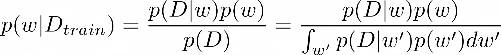
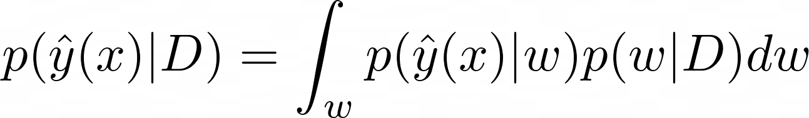

```{r setup, include=FALSE}
knitr::opts_chunk$set(echo = TRUE)

#setwd("C:/Users/tjses/OneDrive/Documents/Spring 2023/PHP 2650 - Big Data/Final Project/php2650project")
```

# Applying Bayesian Inference into Neural Networks

Deep learning is a machine learning technique used for learning neural networks, and for processing data in a more “human” way. Deep Learning Neural Networks are a powerful tool that can be used to approximate solutions to many functions, even if they are not closed form. However, a major problem with neural networks is overfitting, which is when the learning algorithm does such a good job of tuning the parameters on the training set that it performs badly on new data [1]. There are many methods that can be used to reduce overfitting (like early stopping or dropout), but the method we are focusing on is **applying Bayesian inference into the neural network**. 


## Bayesian

The Bayesian paradigm is based on 2 simple ideas: 1) Probability is a measure of belief in the occurrence of events, rather than the limit in the frequency of occurrence (when the number of samples goes to infinity), which is assumed in the frequentist paradigm. 2) Prior beliefs influence posterior probabilities, also known as Bayes theorem [2]. 

## Bayesian Neural Networks (BNNs)

Bayesian inference allows us to learn a probability distribution over possible neural networks [1, which can not only reduce overfitting, but inform us on how much uncertainty the model has. 

Bayesian neural networks are neural networks that are trained using a Bayesian approach [2], meaning that the neural network has a prior on its weights [3]. BNNs are a promising paradigm that allows the generalization of applying deep learning in areas where a system is not allowed to fail [2]. These networks are about modeling uncertainty in parameters [2]. By modeling uncertainty, BNNs provides better prediction accuracy under the same model, and provides better uncertainty estimation for a predictive distribution [3]. BNNs are useful in active learning (human or algorithm labels new points from an unlabeled dataset) and online learning (where a model is retrained as new data becomes available) [2]. 

Normally, a neural networks aims to use the training data D\_train to update the weight parameters   so as to maximize a loss function L. A neural network through the Bayesian approach aims to estimate the posterior distribution (**INSERT EQUATION HERE**), the distribution of the weight parameters given the training data the model is fitted with [1]. 

There are several ways to estimate this posterior distribution - using **exact inference**, approximating the posterior through **sampling methods/techniques**, or using **variational inference** to approximate the posterior distribution. Our project will explore these three methods, and how these methods can be implemented. 

## Exact Inference
This method takes a traditional Bayesian approach to estimate the posterior, where the posterior is computed using Bayes Rule. First, we need to identify the prior distribution of the weights *p(w)* as well as the likelihood function for our training data *p(D|w)*. The prior represents our current belief on what possible values the weight parameters could be, while the likelihood function for the training data is required to estimate the probabilities for each observation of the training data to occur. Through the use of Bayes Rule, the posterior distribution can be calculated as follows: 

<center> 



</center>

After estimating the posterior, the predictive distribution [**INSERT EQUATION HERE**] can be calculated to estimate the output values given any new input: 

<center> 



</center>


This predictive distribution can be interpreted as an infinite ensemble of weights, where each possible network contributes to the overall prediction after being weighted by the posterior likelihood [1]. 

Exact inference is very easy to express, but a downside is that it becomes computationally expensive the more parameters the neural network has. This is due to integration being required over all of the weight parameters, which for the most part can only be approximated numerically. Thus, exact inference is really only feasible for small neural networks.

## Sampling Methods
A sampling method used to exactly sample the posterior is **Markov Chain Monte Carlo (MCMC)**. MCMC algorithms are considered the best tool for sampling from the exact posterior, and tend to be better for high dimensionality problems [1]. 

The assumption of sample independence is sacrificed by using a Markov Chain to produce a sequence of dependent samples [3], with a proposal distribution over choices in the next sample in the sequence conditioned on the previous choice [**INSERT EQUATION HERE!!**] [1]. 

The idea behind MCMC is to construct a Markov Chain (a sequence of random samples Si, which probabilistically depends only on the previous sample Si-1, such that Si are distributed following a desired distribution [4]. Most MCMC algorithms require an initial burn in time before the Markov chain converges to the desired distribution [1]. 

The most relevant MCMC method for Bayesian neural networks is the **Metropolis-Hastings** algorithm. This algorithm uses the proposal distribution mentioned earlier to generate a set of samples that asymptotically are distributed according to *p(w|D)* [1]. The Markov Chain is used to generate candidate samples, and then stochastically accept these samples with probability a, expressed as the acceptance rate: 

<center> 


</center>

This accept rate is equivalent to the ratio of posterior probabilities under the proposed and most recent samples [**INSERT EQUATION HERE**] [1].


## Approximate Inference/Variational Inference


## References

1. Yu, et al. Bayesian Neural Networks. https://www.cs.toronto.edu/~duvenaud/distill_bayes_net/public/

2. Jospin et al (2022). Hands-on Bayesian Neural Networks – A Tutorial for Neural Deep Learning Methods. Machine Learning.IEEE Computational Intelligence Magazine 17(2): 29-48

3. Bayesian Deep Learning [slides]: https://alinlab.kaist.ac.kr/resource/Lec8_Bayesian_DL.pdf
