# Applying Bayesian Inference into Neural Networks

Deep learning is a machine learning technique used for learning neural
networks, and for processing data in a more “human” way. Deep Learning
Neural Networks are a powerful tool that can be used to approximate
solutions to many functions, even if they are not closed form. However,
a major problem with neural networks is overfitting, which is when the
learning algorithm does such a good job of tuning the parameters on the
training set that it performs badly on new data \[1\]. There are many
methods that can be used to reduce overfitting (like early stopping or
dropout), but the method we are focusing on is **applying Bayesian
inference into the neural network**.

## Bayesian

The Bayesian paradigm is based on 2 simple ideas: 1) Probability is a
measure of belief in the occurrence of events, rather than the limit in
the frequency of occurrence (when the number of samples goes to
infinity), which is assumed in the frequentist paradigm. 2) Prior
beliefs influence posterior probabilities, also known as Bayes theorem
\[2\].

A saying that is often used to describe Bayesian is “it’s foolish to
believe something with 100% probability”. A well known example of this
is swans. For the longest time, people used to think there were only
white swans (that all swans were white). But, that statement was proven
wrong when it was discovered that black swans exist.

The idea of Bayesian inference is to take into account everything. This
means to have probabilities, no matter how small, on all possibilities
(all possible outcomes), so we can update our prior belief/knowledge
when new information is obtained. In the context of a model, leaving
everything with probability allows the model to take into account future
information and update it, rather than making a new model.

## Bayesian Neural Networks (BNNs)

Bayesian inference allows us to learn a probability distribution over
possible neural networks \[1\], which can not only reduce overfitting,
but inform us on how much uncertainty the model has.

Bayesian neural networks are neural networks that are trained using a
Bayesian approach \[2\], meaning that the neural network has a prior on
its weights \[3\]. BNNs are a promising paradigm that allows the
generalization of applying deep learning in areas where a system is not
allowed to fail \[2\]. These networks are about modeling uncertainty in
parameters \[2\]. By modeling uncertainty, BNNs provide better
uncertainty estimation for a predictive distribution \[3\]. BNNs are
useful in active learning (human or algorithm labels new points from an
unlabeled dataset) and online learning (where a model is retrained as
new data becomes available) \[2\].

<figure>
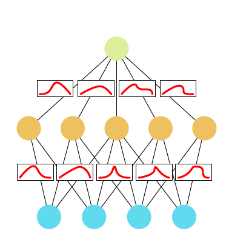
<figcaption aria-hidden="true">
<em>Figure 1. Stochastic neural network with a probability distribution
over the weights (2) </em>
</figcaption>
</figure>

Normally, a neural networks aims to use the training data
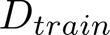 to update the weight
parameters
 so
as to maximize a loss function *L(w)*. A neural network through the
Bayesian approach aims to estimate the posterior distribution
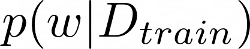,the
distribution of the weight parameters given the training data the model
is fitted with \[1\].

There are several ways to estimate this posterior distribution - using
**exact inference**, approximating the posterior through **sampling
methods/techniques**, or using **variational inference** to approximate
the posterior distribution. Our project will explore these three
methods, and how these methods can be implemented.

## Exact Inference

This method takes a traditional Bayesian approach to estimate the
posterior, where the posterior is computed using Bayes Rule. First, we
need to identify the prior distribution of the weights *p(w)* as well as
the likelihood function for our training data *p(D\|w)*. The prior
represents our current belief on what possible values the weight
parameters could be, while the likelihood function for the training data
is required to estimate the probabilities for each observation of the
training data to occur. Through the use of Bayes Rule, the posterior
distribution can be calculated as follows:

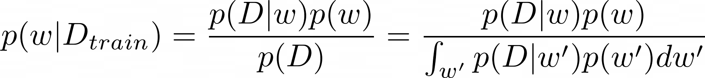

After estimating the posterior, the predictive distribution
 can be calculated
to estimate the output values given any new input:

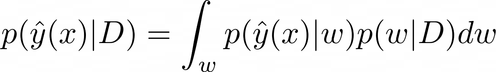

This predictive distribution can be interpreted as an infinite ensemble
of weights, where each possible network contributes to the overall
prediction after being weighted by the posterior likelihood \[1\].

Exact inference is very easy to express, but a downside is that it
becomes computationally expensive the more parameters the neural network
has. This is due to integration being required over all of the weight
parameters, which for the most part can only be approximated
numerically. Thus, exact inference is really only feasible for small
neural networks.

## Sampling Methods

A sampling method used to exactly sample the posterior is **Markov Chain
Monte Carlo (MCMC)**. MCMC algorithms are considered the best tool for
sampling from the exact posterior, and tend to be better for high
dimensionality problems \[1\].

The assumption of sample independence is sacrificed by using a Markov
Chain to produce a sequence of dependent samples \[3\], with a proposal
distribution over choices in the next sample in the sequence conditioned
on the previous choice
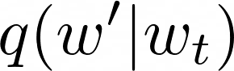 \[1\].

The idea behind MCMC is to construct a Markov Chain (a sequence of
random samples
)
which probabilistically depends only on the previous sample
,
such that

are distributed following a desired distribution \[2\]. Most MCMC
algorithms require an initial burn in time before the Markov chain
converges to the desired distribution \[1\].

A popular MCMC method for Bayesian neural networks is the
**Metropolis-Hastings** algorithm. This algorithm uses the proposal
distribution mentioned earlier to generate a set of samples that
asymptotically are distributed according to *p(w\|D)* \[1\]. The Markov
Chain is used to generate candidate samples, and then stochastically
accept these samples with probability a, expressed as the acceptance
rate:

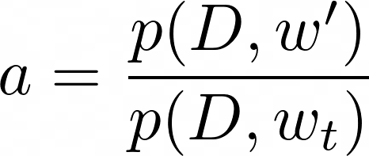

This accept rate is equivalent to the ratio of posterior probabilities
under the proposed and most recent samples
\[1\].

## Approximate Inference/Variational Inference

Approximating the posterior through variational methods is done through
a way where the learning the approximation of a posterior scales better
than the MCMC algorithm \[2\]. Variational methods model the posterior
*p(w\|D)* using a parametrized distribution,
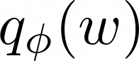 called the
**approximate posterior** (which is a “parametrized, tractable-stand in
distribution” \[1\]) (The parametrized variational distribution over the
weights  is
specified). Then, the parameter

is tuned so it better approximates the intractable distribution \[1\].
This approximation is teratively improved by solving a suitable
optimization problem \[1\].

The type of variational method we’ll be focusing on is Bayes by
backpropagation, or backprop for short. This is an implementation of
stochastic variational inference that is combined with a
“reparametrization trick” to ensure backpropagation works \[2\]. Bayes
by backprop is a backpropagation compatible algorithm for learning a
probability distribution on the weights of a neural network. This
algorithm regularizes the weights by minimizing a compression cost (also
known as variational free energy) or the expected lower bound on the
marginal likelihood \[4\]. Backpropagation is typically used to train
the posterior distribution parameters to the input and output data based
on the optimization problem. This method makes it similar to the
standard neural networks, where they use an optimization problem to
directly update the weights for prediction.

The common measure of closeness used is the **Kullback-Liebler
divergence** (KL-divergence), a similarity measure for two distributions
which is used to commonly measure dissimilarity between two observations
\[1\].

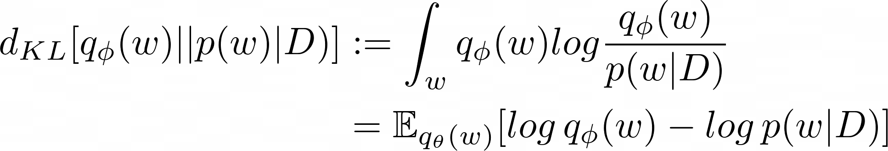

The compression cost formula can be seen in the second line of the
KL-divergence formula/equation. **Bayes by Backprop**, which is a
backpropagation algorithm that is used for learning a probability
distribution on the weights of a neural network, uses the unbiased
estimates of the gradients in the cost function to learn the
distribution of the weights of a neural network \[4\].

## Application

We will implement variational inference using Kullback-Liebler/Bayes by
Backprop and MCMC on bayesian neural networks using Python (keras and
pytorch libraries).

First, we will implement a Bayesian neural network using variational
inference for a sine function:
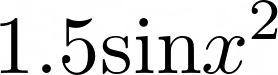 with some randomness
(+1 on average). We fit a Bayesian neural network with 3 layers, with a
prior of 0.1, using a feed-forward approach.

    model = nn.Sequential(
    bnn.BayesLinear(prior_mu=0, prior_sigma=0.1, in_features=1, out_features=1000),
    nn.ReLU(),
    bnn.BayesLinear(prior_mu=0, prior_sigma=0.1, in_features=1000, out_features=500),
    nn.ReLU(),
    bnn.BayesLinear(prior_mu=0, prior_sigma=0.1, in_features=500, out_features=1),
    )

<figure>
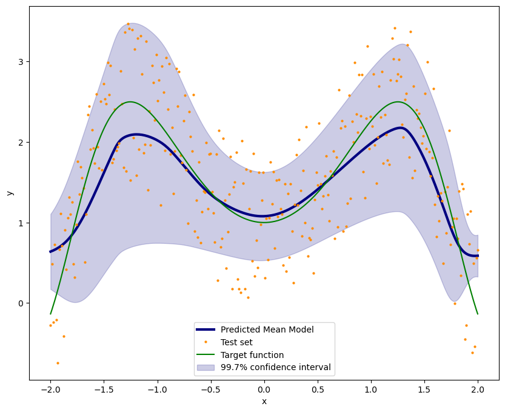
<figcaption aria-hidden="true">
<em>Figure 2. Plot of ….</em>
</figcaption>
</figure>

***EXPLANATION!!!!***

-   The predicted mean model is close to the target function.

<u>Concrete Data </u>

This dataset was found on Kaggle, an online platform that has publicly
avilable datasets for use. This dataset contains information on 8
different components/features used to make concrete for 1,030 concrete
samples, with the outcome of interest being concrete compressive
strength. All the variables are quantitative.

Description of the Dataset (from Kaggle) \[5\]:

> Concrete is the most used material for construction in the world!
> There are some components that should be combined to make the
> concrete. These components can affect the compressive strength of the
> concrete. To obtain the real compressive strength of concrete (target
> labels in the dataset), an engineer needs to break the cylinder
> samples under the compression-testing machine. The failure load is
> divided by the cylinder’s cross-section to obtain the compressive
> strength. Engineers use different kinds of concretes for different
> building purposes. For example, the strength of concrete used for
> residential buildings should not be lower than 2500 psi (17.2 MPa).
> Concrete is a material with high strength in compression, but low
> strength in tension. That is why engineers use reinforced concrete
> (usually with steel rebars) to build structures.

<table>
<colgroup>
<col style="width: 36%" />
<col style="width: 63%" />
</colgroup>
<thead>
<tr class="header">
<th>
Variable
</th>
<th>
Description
</th>
</tr>
</thead>
<tbody>
<tr class="odd">
<td>
cement
</td>
<td>
Cement (kg in a m3 mixture)
</td>
</tr>
<tr class="even">
<td>
slag
</td>
<td>
Blast Furnace Stag (kg in a m3 mixture)
</td>
</tr>
<tr class="odd">
<td>
flyash
</td>
<td>
Fly Ash Stag (kg in a m3 mixture)
</td>
</tr>
<tr class="even">
<td>
water
</td>
<td>
Water (kg in a m3 mixture)
</td>
</tr>
<tr class="odd">
<td>
superplasticizer
</td>
<td>
Superplasticizer component (kg in a m3 mixture)
</td>
</tr>
<tr class="even">
<td>
coarseaggregate
</td>
<td>
Coarse Aggregate (kg in a m3 mixture)
</td>
</tr>
<tr class="odd">
<td>
fineaggregate
</td>
<td>
amount of Fine Aggregate (kg in a m3 mixture)
</td>
</tr>
<tr class="even">
<td>
age
</td>
<td>
Age of the concrete sample (in days); ranges from 1-365 days
</td>
</tr>
<tr class="odd">
<td>
csMPa
</td>
<td>
concrete compressive strength in MPa (output variable)
</td>
</tr>
</tbody>
</table>

We will implement variational and sampling methods on this concrete
linear regression dataset. To prevent gradient explosion we standardized
all the predicted variables.

### Variational Inference

    model = nn.Sequential(
    bnn.BayesLinear(prior_mu=0, prior_sigma=2, in_features=7, out_features=1000),
    nn.Sigmoid(),
    bnn.BayesLinear(prior_mu=0, prior_sigma=2, in_features=1000, out_features=100),
    nn.Sigmoid(),
    bnn.BayesLinear(prior_mu=0, prior_sigma=2, in_features=100, out_features=1),
    )

***EXPLANATION***

<figure>
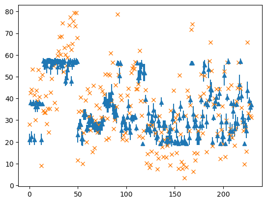
<figcaption aria-hidden="true">
<em>Figure 3. Plot of ….</em>
</figcaption>
</figure>

### MCMC Sampling

For MCMC, the y values were divided by 100 to be within a 0 to 1 scale
for prediction. The y values were rescaled back to the original concrete
mpa values after predicting the values. For implementing MCMC, we used
an algorithm from Chandra et al that used Langevin-based MCMC sampling
on a Bayesian neural network framework \[6\]. This algorithm outputs a
posterior distribution of the model parameters (specifically the weights
and biases) \[6\].

1. Draw initial values

from the prior 

2. Generate proposal distribution for
 which incorporates the model
weights and

from a Langevin gradient or random walk proposal distribution. r 

3. Evaluate the likelihood of the prior: r 

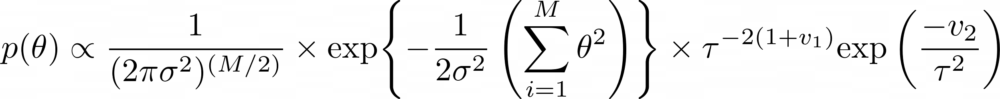

4. Proposal distribution is valuated using BNN model with the following
likelihood function: r 

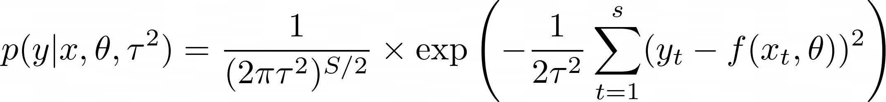

1.  Using the likelihoods found in steps 3 and 4, check if proposal
    distribution should be accepted by using Metropolis-Hasting
    algorithm/equation to compute the posterior probability:

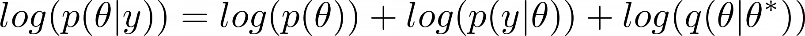

1.  If the proposal is accepted, the proposal distribution becomes a
    part of the MCMC chain. If the proposal is not accepted, keep the
    current state of the chain.

These steps are repeated until the maximum number of samples are
reached.

1.  Obtain posterior distribution by combining the samples in the chain.

***MENTION THE ALGORITHM USED***

<figure>
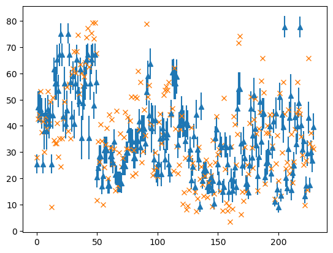
<figcaption aria-hidden="true">
<em>Figure 4. Plot of ….</em>
</figcaption>
</figure>

***EXPLANATION*** (of plot!!)

## References

1.  Yu, et al. Bayesian Neural Networks.
    <https://www.cs.toronto.edu/~duvenaud/distill_bayes_net/public/>

2.  Jospin et al (2022). Hands-on Bayesian Neural Networks – A Tutorial
    for Neural Deep Learning Methods. Machine Learning.IEEE
    Computational Intelligence Magazine 17(2): 29-48

3.  Bayesian Deep Learning \[slides\]:
    <https://alinlab.kaist.ac.kr/resource/Lec8_Bayesian_DL.pdf>

4.  Blundell, et al. Weight Uncertainty in Neural Networks.
    <https://arxiv.org/abs/1505.05424>

5.  Concrete Dataset:
    <https://www.kaggle.com/datasets/sinamhd9/concrete-comprehensive-strength>

6.  Chandra, et al. Bayesian Neural Networks via MCMC: a Python-based
    tutorial. <https://arxiv.org/pdf/2304.02595v1.pdf>

-   Reference: I-Cheng Yeh, “Modeling of strength of high performance
    concrete using artificial neural networks,” Cement and Concrete
    Research, Vol. 28, No. 12, pp. 1797-1808 (1998).
